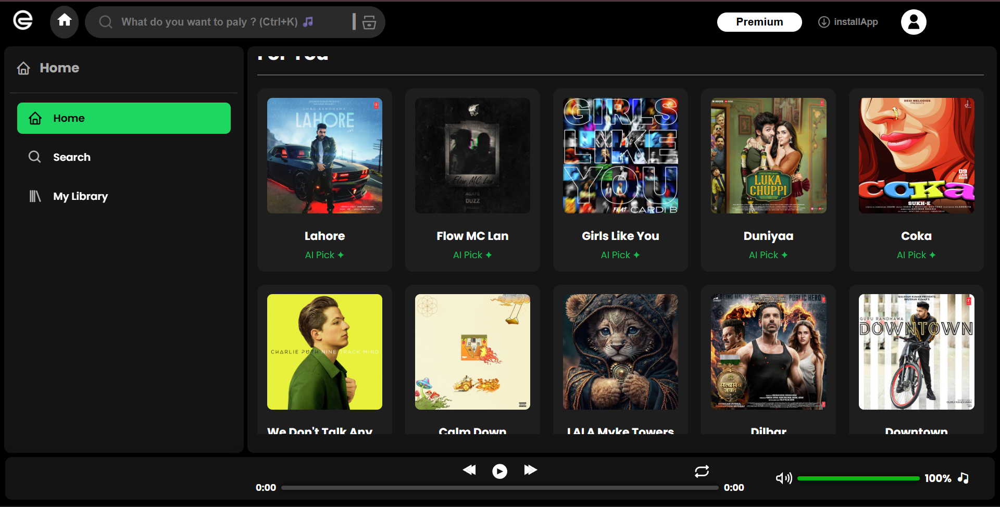
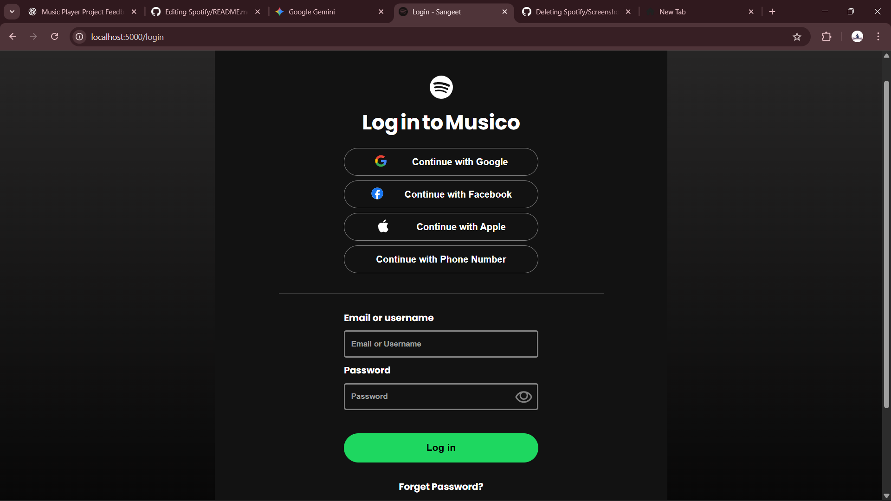
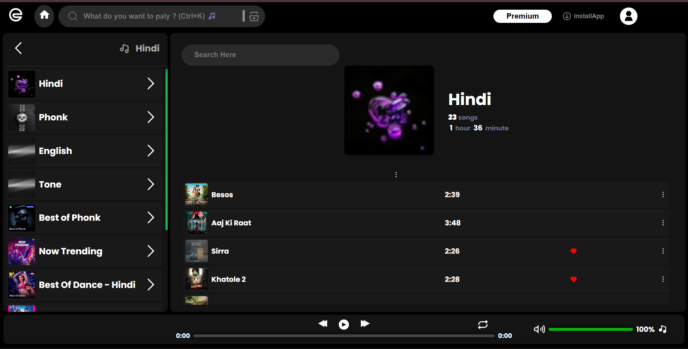
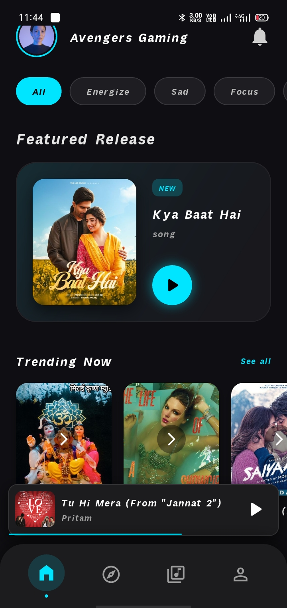

# 🎵 Music Streaming Web & Mobile App

A full-stack Spotify-style music streaming application with authentication,
user-specific playlists, and **personalized music recommendations**
based on user interaction history.

This project is built with a **scalable backend** that supports both
**web and mobile clients**.

---

## 📸 Screenshots

### 🌐 Web App
<p align="center">
  
  <br/><br/>
  
  <br/><br/>
  
</p>

### 📱 Mobile App
<p align="center">
  
</p>

---

## 🚀 Features

- 🔐 User Authentication (JWT based)
- 🎶 Stream and browse songs
- 📂 Create & manage playlists
- ❤️ Track user interactions (likes, plays, skips)
- 🧠 Personal music recommendations based on recent user activity
- 📱 Mobile-friendly & Android app support
- 🌐 REST APIs reusable across platforms

---

## 🛠 Tech Stack

### Backend
- Node.js
- Express.js
- MongoDB + Mongoose
- JWT Authentication

### Frontend (Web)
- EJS / HTML / CSS / JavaScript

### Mobile App
- Flutter (Android)

---

## 🧩 Recommendation Logic

- User interactions are logged (play, like, skip, artist preference)
- Only the **latest 50 interactions** are stored to optimize performance
- Recommendations are generated dynamically based on recent behavior
- This avoids heavy ML models while still providing personalization

---

## 📱 Mobile Version

The mobile application consumes the same backend APIs used by the web app,
ensuring consistency across platforms.

---

## 📂 Project Structure
backend/
 ├── routes
 ├── models
 ├── middleware

frontend/
 ├── views
 ├── public

mobile/
 ├── flutter_app


## 🌍 Live Demo

- 🚀 **AWS Deployed Version**  
  http://65.0.27.213:5000/

- 🌐 **Render Deployed Version**  
  http://spotify-qn5m.onrender.com/

> The application is deployed on both **AWS EC2** and **Render** to demonstrate
real-world deployment, scalability, and environment handling.


---

## ⚙️ Installation & Setup

```bash
git clone https://github.com/Rohit8577/Spotify.git
cd spotify
npm install
npm run dev
``` 

---

## 👨‍💻 Author

**Rohit Bind**  
🎓 Computer Science Engineering Student  
💻 Full Stack Web Developer  

**Skills & Tools:**  
- JavaScript, Node.js, Express.js  
- MongoDB, JWT Authentication  
- HTML, CSS, EJS  
- Flutter (Android)  
- Git & GitHub  

**Projects:**  
- Spotify-style Music Streaming Web & Mobile App  
- Public Distribution System (PDS) Management System  

📫 **GitHub:** https://github.com/Rohit8577

> This project was built to understand real-world backend architecture,
API design, authentication, deployment, and personalization systems.
